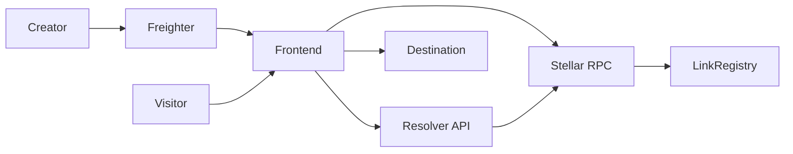

# System architecture

Blink separates public delivery from ownership authority.

## Components

### Frontend

Owns the wallet experience, transaction construction, signing, confirmation UI, and public redirect route.

### Backend

Provides a stable read API around contract resolution. It is designed to become the operational boundary for caching, abuse controls, analytics, and RPC failover.

### Contracts

Own the canonical mapping between aliases and their wallet owners. Contract authorization, rather than a web account, controls mutations.

### Documentation

Keeps operational and protocol knowledge independent from application release cycles.

